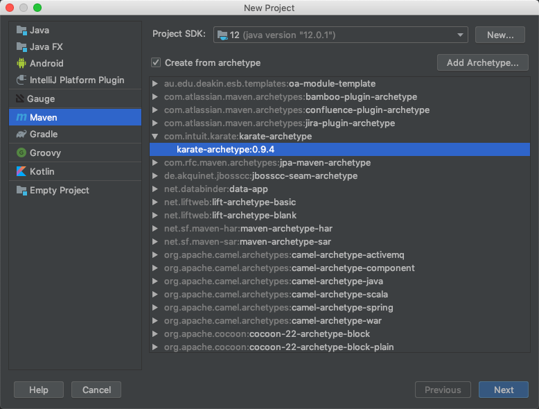
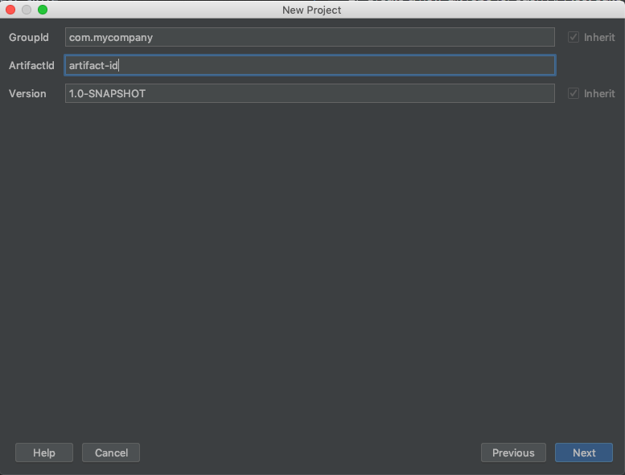
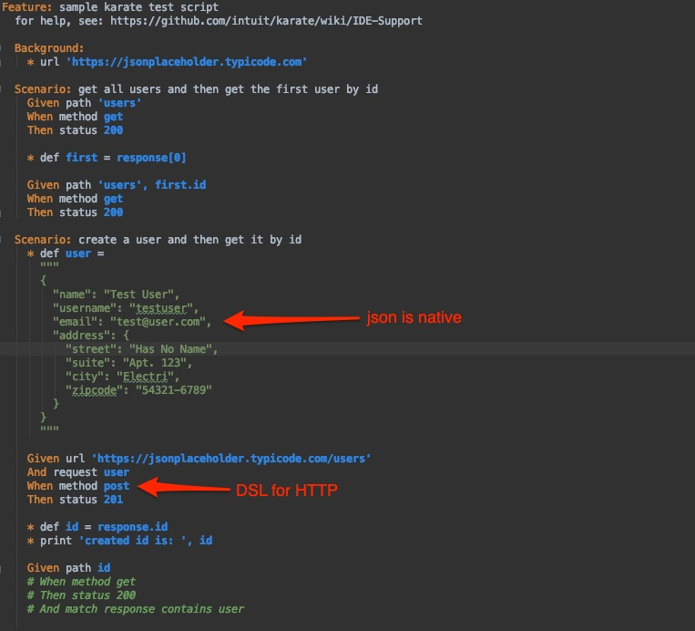
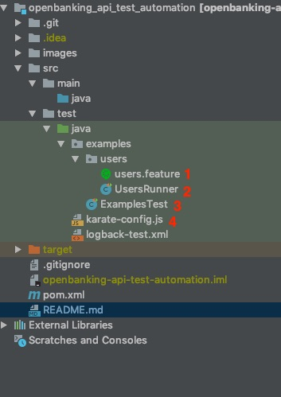

# OpenBanking API Test Automation 

Some throughout comparision between different API automation frameworks has been done by third parties which we can leverage to select the most suitable frameworks based on below criteria
* **Simplicity**: low entry barrier, human (not just developer) friendly, least effort
* **Comprehensiveness**: ideally the selected framework should support performance test and / or mocking of service
* **Cost**: should be completely free and / or open-source


The selected framework details are below
* **Base tool**: Intuit Karate
* **BDD**: Cucumber (Gherkin) 
* **Backend**: Java
* **Build tool**: Maven
* **IDE**: Intellij or any Java-supporting IDE 

__Reference__

* [9 great open-source API testing tools: How to choose](https://techbeacon.com/app-dev-testing/9-great-open-source-api-testing-tools-how-choose)

* [Intuit Karate versus REST Assured](https://docs.google.com/document/d/1ETTrdMVcBXaPjdKY-_67zCWBsi2Ctc5DIQUIfr02H7A/edit)


## Getting started

### Hello World
1. Install Java, Git, Maven (if have not done so)
2. Create a new Git repo for each API  test suite and clone to your local machine
3. Running below command to scaffold the test suite

    ```
    mvn archetype:generate \
    -DarchetypeGroupId=com.intuit.karate \
    -DarchetypeArtifactId=karate-archetype \
    -DarchetypeVersion=[0.9.4 or the most suitable version at reading time] \
    -DgroupId=[your group Id e.g. com.mycompany] \
    -DartifactId=[your artifact Id e.g. sample-api-test-automation]
    ```
    Or if you prefer working with GUI

     
     

4. Once sample test suite is created, right click on the test suite and hit `Run`. Alternatively, you can run each `.feature` (normally for 1 test scenario)

     


### Folder Structure

 

All Git and IDE related folders / files (.idea, .git, *.iml) can be safely ignored. The focus is on `src/test/java` (referring to the annotation in above image)

1. `*.feature` is where you define test script using Given When Then format
2. Test scenario runner is a Java / Kotlin class which enable running `*.feature` via mvn command and by CI server. 
    * The advantage as compare to Cucumber is that no step definition is needed.
    * **IMPORTANT** the `mvn test` command only runs test classes that follow the `*Test.java` naming convention by default. But you can choose a single test to run like this `mvn test -Dtest=ATestRunner`
3. Test case runner is similar to test scenario runner but it's supposed to run all `*.feature` in sub-folders
4. `karate-config.js` is where you define variables for environments, API key, Auth header etc. which then can be passed in to mvn command at run time. This externalize all environment config & credentials from checked in code and only be made available at run time.

## Common Usage

### Send a HTTP Request 

```cucumber
Feature: Verify various combinations of Member API

  Background:
    * url baseUrl
    * def secretKey = apiKey
    * def txId = transactionId
    * def req_headers = {Authorization: '#(secretKey)', transactionId: '#(txId)', creationTime: '2019-08-01T12:00:00.000', timestamp: '2019-08-01T12:00:00.000Z' }

  Scenario: Verify Member details using member id
    Given path 'v1/members'
    And param memberId = '123456'
    And headers req_headers
    When method get
    Then status 200
    * def memIdResponse = response
    And  match memIdResponse.totalRecords == 1
    And  match memIdResponse contains { _embedded : {members: #notnull} }
    And  match memIdResponse._embedded.members[0].firstName == '#regex ^(H|h)(A|a)(R|r)(R|r)(Y|y)$'
    And  match memIdResponse._embedded.members[0].lastName == '#regex ^(L|l)(E|e)(E|e)$'
    And  match response._embedded.members[0].gender == '#regex ^(M|m)(A|a)(L|l)(E|e)$'
    And  match memIdResponse._embedded.members[0].status == "Active"
```
* In the above example, `apiKey`, `transactionId` etc. are defined in `karate-config.js` file but their real values are usually environment specific and should be supplied at runtime.

* `*` can be interpreted as any of Given, When, Then, And, but when an action doesn’t serve a context, we can use `*`.

* The method can be any valid HTTP verb (Get, Post, Put, Patch, Delete)

* ‘def‘ is used to store a value in a variable.

* header, url, request, method, status, response are all karate’s keywords forming the DSL. For the full list of keywords, visit Intuit.

* In the above example, the response is JSON format, so we can use karate’s builtin JsonPath notation to parse the response.

### Chaining multiple API calls
```gherkin
Feature: request chaining with multiple api calls
 
Scenario: chain request demo
 
    * json req = read('classpath:com/example/templates/idm/create-user-template.json')
    * def user = req.givenName
 
    Given header X-Username = 'anonymous'
    Given header X-Password = 'anonymous'
    Given url AM_HOST + '/some/endpoint
    And request ''
    When method POST
 
    * def authId = response.authId
 
    * def payload1 =
    """
    {"authId":"${authId}","callbacks":[{"type":"NameCallback","output":[{"name":"prompt","value":"Email Address"}],"input":[{"name":"IDToken0","value":"${user}@putsbox.com"}]}]}
    """
 
    * replace payload1
    | token     | value  |
    | ${authId} | authId |
    | ${user}   | user   |
 
    * json mypayload1 = payload1
 
    Given header X-Username = 'anonymous'
    Given header X-Password = 'anonymous'
    Given url AM_HOST + '/openam/some-other-endpoint
    And request mypayload1
    When method POST
```
* In the above example, the first call is made and authId is parsed from the response and saved in a variable called `authId`. We then replace the second payload with the authId retrieved in the first call. We then use the new payload to send to the next API call.

### Read request templates and call other feature files

We can make our scenarios reusable and call them from other feature files. In this example, we can create a “generic” create-user.feature file where we can send the create user request but with a different request body
```
Feature: Create User in IDM
 
  Scenario: Create user in IDM with given guid
 
    Given header X-Requested-With = 'Swagger-UI'
    Given header X-OpenIDM-Username = IDM_USERNAME
    Given header X-OpenIDM-Password = IDM_PASSWORD
    Given url IDM_HOST + IDM_MANAGED_USER_PATH
    And request __arg
    When method POST
    Then status 201
```
Note, in the above example, we are using `__arg` as the post body request. We can then call the above feature file and pass in the required post body, which in turn we can read from a template

```
Feature: Create a user
 
  Scenario: Create user in IDM 
 
    * json myReq = read('classpath:com/example/templates/idm/idm-create-user-template.json')
    * call read('classpath:com/example/idm/idm-create-user.feature') myReq
```

The above code reads a template which is in location `com/example/templates/idm/idm-create-user-template.json` and stores it as a JSON variable called myReq

Then we can send the JSON variable to the other feature file using the call method.

The template looks like
```json
{
  "mail" : "john@company.com",
  "givenName" : "john",
  "jobRole" : "developer",
  "telephoneNumber" : "0412345678",
  "dob" : "01/01/2010",
}
```

We can read a specific variable in the called feature file which is passed from a calling feature file

```
Feature: Create User in IDM
 
  Scenario: Create user in IDM with given guid
 
    Given header X-Requested-With = 'Swagger-UI'
    Given header X-OpenIDM-Username = IDM_USERNAME
    Given header X-OpenIDM-Password = IDM_PASSWORD
    Given url IDM_HOST + IDM_MANAGED_USER_PATH
    And request __arg.emailAddress
    When method POST
    Then status 201
```

Note, in the above example, we are using `__arg.emailAddress` as the post body request. We are only interested in sending the email address as the request. We can then call the above feature file and pass in the required post body, which in turn we can read from a template.

```
Feature: Create a user
 
  Scenario: Create user in IDM 
     
    * json myReq = read('classpath:com/example/templates/idm/idm-create-user-template.json')
    * json emailAddress = '{"emailAddress": "' +myReq.mail+ '"}'
    * call read('classpath:com/example/fr/idm/idm-create-user.feature') emailAddress
```

The above code extracts the mail field from the JSON template. When we pass a variable to another feature file, it must be of type JSON, so the variable emailAddress must be a valid JSON. Then we can send the JSON variable to the other feature file using the call method and be sending the JSON variable, in this case, `emailAddress`.

### Create a Test Runner class

We can execute the scenarios in the feature file using maven (which is useful to run the tests in a CI environment)

```java

import com.intuit.karate.cucumber.CucumberRunner;
import com.intuit.karate.cucumber.KarateStats;
import cucumber.api.CucumberOptions;
import net.masterthought.cucumber.Configuration;
import net.masterthought.cucumber.ReportBuilder;
import org.apache.commons.io.FileUtils;
import org.testng.annotations.Test;
 
import java.io.File;
import java.util.ArrayList;
import java.util.Collection;
import java.util.List;
 
import static org.testng.AssertJUnit.assertTrue;
 
@CucumberOptions(
//        features = "src/test/java/FeatureFiles",
        plugin = {"pretty", "html:target/cucumber-html-report"},
        format = {"json:target/cucumber.json"},
        dryRun=false,
        monochrome=false,
        tags = {"~@ignore","@primary,@secondary,@negative"}
)
public class TestRunner_FR {
 
    @Test
    public void testParallel() {
        String karateOutputPath = "target/cucumber-html-reports";
        KarateStats stats = CucumberRunner.parallel(getClass(), 1, karateOutputPath);
        generateReport(karateOutputPath);
        assertTrue("there are scenario failures", stats.getFailCount() == 0);
    }
 
    private static void generateReport(String karateOutputPath) {
        Collection jsonFiles = FileUtils.listFiles(new File(karateOutputPath), new String[] {"json"}, true);
        List jsonPaths = new ArrayList(jsonFiles.size());
        for (File file : jsonFiles) {
            jsonPaths.add(file.getAbsolutePath());
        }
        Configuration config = new Configuration(new File("target"), "YOUR PROJECT NAME");
        config.addClassifications("Environment", System.getProperty("karate.env"));
        ReportBuilder reportBuilder = new ReportBuilder(jsonPaths, config);
        reportBuilder.generateReports();
    }
}
```
* The above code runs all the feature files which are tagged as `@primary,@secondary,@negative` but ignores all the tests which are tagged as “@ignore”. 

* It also creates a cucumber report for visualizing the results of the test runs.


### Execute JavaScript in the Feature file

```javascript
Feature: Generate a random session id
 
  Scenario: generate random session id
    * def random_string =
    """
    function(s) {
      var text = "";
      var possible = "ABCDEFGHIJKLMNOPQRSTUVWXYZabcdefghijklmnopqrstuvwxyz";
      for (var i = 0; i < s; i++)
        text += possible.charAt(Math.floor(Math.random() * possible.length));
      return text;
    }
    """
    * def sessionId =  random_string(10)
```

The above code generates a random string of length 10 and saves it in a variable called sessionId.

### Call Java from a feature file

```
package com.example;
 
public class StringUtil {
 
    public static String getNumberFromString(String text) {
        return text.replaceAll("\\D+", "");
    }
}
```

```
Feature: Call java demo
 
Scenario: Get number from text
 
    Given url 'https://preview.putsbox.com/p/david/last.json'
    When method GET
    * def emailText = response.text
    * def otpCode = Java.type('com.example.StringUtil').getNumberFromString(emailText)
    * print otpCode
```

The above feature file calls a Java method in the class called StringUtil. Then saves the response of that call to otpCode variable.

### Data Driven Tests
Since Karate sits on top of cucumber, data-driven testing comes as default
```
Feature: Data driven testing example
 
Scenario Outline: An 'Invalid input request' error is returned if required parameters have incorrect values.
 
    * def attribute_name = '<name_attribute>'
    * xml malformed_request = <method_call>
    * json activate_request = malformed_request
 
    * def activate_response = call read('activate.feature') activate_request
 
    * match activate_response.contentType == 'text/xml;charset=ISO-8859-1'
    * match activate_response.gas_version == '5.2.7'
    * match activate_response.error_code == '1000'
 
    Examples:
      | name_attribute  | method_call                                                                        |
      | auth_method     | Java.type('com.example.StringUtil').removeNodeByAttribute(xml_req, attribute_name) |
      | app_url         | Java.type('com.example.StringUtil').removeNodeByAttribute(xml_req, attribute_name) |

```
The example above utilizes Cucumber’s Scenario Outline and Examples keywords to create data-driven tests. To read each parameter, we use the angle brackets <>

## CI or Command Line Testing

Assuming `env` is defined in `karate-config.js`, below command can be invoked manually or by CI server to execute the entire test suite via test runner class

```
mvn clean test -DargLine="-Dkarate.env=staging" -Dtest=TestRunner_FR
```


Assuming that Cucumber options are configured in test runner files, particular feature file can be invoke using below command

```
mvn clean test -Dcucumber.options="src/test/java/examples/users/users.feature" -Dkarate.env="qat" "-DauthPassword=<enter Authcode here>"
```  


