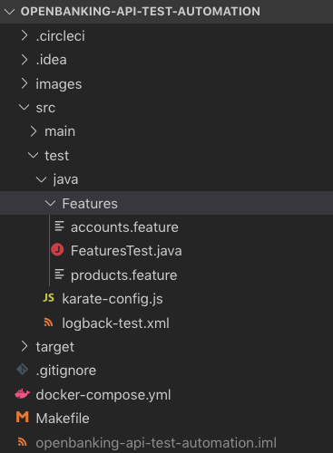

# OpenBanking API Test Automation

Some throughout comparision between different API automation frameworks has been done by third parties which we can leverage to select the most suitable frameworks based on below criteria
* **Simplicity**: low entry barrier, human (not just developer) friendly, least effort
* **Comprehensiveness**: ideally the selected framework should support performance test and / or mocking of service
* **Cost**: should be completely free and / or open-source


The selected framework details are below
* **Base tool**: Intuit Karate
* **BDD**: Cucumber (Gherkin)
* **Build tool**: make, docker, docker-compose
* **IDE**: any

__Reference__

* [9 great open-source API testing tools: How to choose](https://techbeacon.com/app-dev-testing/9-great-open-source-api-testing-tools-how-choose)

* [Intuit Karate versus REST Assured](https://docs.google.com/document/d/1ETTrdMVcBXaPjdKY-_67zCWBsi2Ctc5DIQUIfr02H7A/edit)


## Getting started
Prerequisite: make, docker, docker-compose

### Running this test suite

`make test`

### New test

1. Clone or fork this repo (openbanking-api-test-automation) then add / replace `*.feature` files for new tests

2. Right click on each new `.feature` hit `Run`. Alternatively, `make test` to run the entire suite


### Folder Structure



1. `*.feature` is where you define test script using Given When Then format
2. `karate-config.js` externalizes all environment config & credentials from checked in code. This is where you define variables for environments, API key, Auth header etc. which can be provided at run time.
3. `FeaturesTest.java` is test runner. This needs no change


## Common Usage

### Send a HTTP Request

```gherkin
Feature: Accounts

  Background:
    * url baseUrl

  @positive
  Scenario: Obtain a list of accounts
    Given path 'banking/accounts'
    And param open-status = 'ALL'
    And param page = 1
    And param page-size = 25
    When method get
    Then status 200
    * def accounts = response.data.accounts
    And match accounts[0].accountId == 'accountId'
    And match response.meta.totalPages == 6
```
* In the above example, `baseUrl` is defined in `karate-config.js` file but its value is usually environment specific and can be supplied at runtime.

* The method can be any valid HTTP verb (Get, Post, Put, Patch, Delete)

* `*` can be interpreted as any of Given, When, Then, And, but when an action doesn’t serve a context, we can use `*`.

* header, url, request, method, status, response are all karate’s keywords forming the DSL. For the full list of keywords, visit Intuit.

* ‘def‘ is used to store a value in a variable.

* In the above example, the response is JSON format, so we can use karate’s builtin JsonPath notation to parse the response.

### Chaining multiple API calls
```gherkin
Feature: Products

  Background:
    * url baseUrl

  @positive
  Scenario: obtain detailed information on a single product offered openly to the market
    Given path 'banking/products'
    When method get
    Then status 200
    * def productId = response.data.products[0].productId


    Given path 'banking/products'
    And path productId
    When method get
    Then status 200
    And match response.links.self == 'self'

```
* In the above example, the first call is made and productId is parsed from the response and saved in a variable called `productId`. We then use productId as part of the second call.

### Read request templates and call other feature files

We can make our scenarios reusable and call them from other feature files. In this example, we can create a “generic” create-user.feature file where we can send the create user request but with a different request body
```gherkin
Feature: Create User in IDM

  Scenario: Create user in IDM with given guid

    Given header X-Requested-With = 'Swagger-UI'
    Given header X-OpenIDM-Username = IDM_USERNAME
    Given header X-OpenIDM-Password = IDM_PASSWORD
    Given url IDM_HOST + IDM_MANAGED_USER_PATH
    And request __arg
    When method POST
    Then status 201
```
Note, in the above example, we are using `__arg` as the post body request. We can then call the above feature file and pass in the required post body, which in turn we can read from a template

```gherkin
Feature: Create a user

  Scenario: Create user in IDM

    * json myReq = read('classpath:com/example/templates/idm/idm-create-user-template.json')
    * call read('classpath:com/example/idm/idm-create-user.feature') myReq
```

The above code reads a template which is in location `com/example/templates/idm/idm-create-user-template.json` and stores it as a JSON variable called myReq

Then we can send the JSON variable to the other feature file using the call method.

The template looks like
```json
{
  "mail" : "john@company.com",
  "givenName" : "john",
  "jobRole" : "developer",
  "telephoneNumber" : "0412345678",
  "dob" : "01/01/2010",
}
```

We can read a specific variable in the called feature file which is passed from a calling feature file

```gherkin
Feature: Create User in IDM

  Scenario: Create user in IDM with given guid

    Given header X-Requested-With = 'Swagger-UI'
    Given header X-OpenIDM-Username = IDM_USERNAME
    Given header X-OpenIDM-Password = IDM_PASSWORD
    Given url IDM_HOST + IDM_MANAGED_USER_PATH
    And request __arg.emailAddress
    When method POST
    Then status 201
```

Note, in the above example, we are using `__arg.emailAddress` as the post body request. We are only interested in sending the email address as the request. We can then call the above feature file and pass in the required post body, which in turn we can read from a template.

```gherkin
Feature: Create a user

  Scenario: Create user in IDM

    * json myReq = read('classpath:com/example/templates/idm/idm-create-user-template.json')
    * json emailAddress = '{"emailAddress": "' +myReq.mail+ '"}'
    * call read('classpath:com/example/fr/idm/idm-create-user.feature') emailAddress
```

The above code extracts the mail field from the JSON template. When we pass a variable to another feature file, it must be of type JSON, so the variable emailAddress must be a valid JSON. Then we can send the JSON variable to the other feature file using the call method and be sending the JSON variable, in this case, `emailAddress`.

### Execute JavaScript in the Feature file

```gherkin
Feature: Generate a random session id

  Scenario: generate random session id
    * def random_string =
    """
    function(s) {
      var text = "";
      var possible = "ABCDEFGHIJKLMNOPQRSTUVWXYZabcdefghijklmnopqrstuvwxyz";
      for (var i = 0; i < s; i++)
        text += possible.charAt(Math.floor(Math.random() * possible.length));
      return text;
    }
    """
    * def sessionId =  random_string(10)
```

The above code generates a random string of length 10 and saves it in a variable called sessionId.

### Call Java from a feature file

```java
package com.example;

public class StringUtil {

    public static String getNumberFromString(String text) {
        return text.replaceAll("\\D+", "");
    }
}
```

```gherkin
Feature: Call java demo

Scenario: Get number from text

    Given url 'https://preview.putsbox.com/p/david/last.json'
    When method GET
    * def emailText = response.text
    * def otpCode = Java.type('com.example.StringUtil').getNumberFromString(emailText)
    * print otpCode
```

The above feature file calls a Java method in the class called StringUtil. Then saves the response of that call to otpCode variable.

### Data Driven Tests
Since Karate sits on top of cucumber, data-driven testing comes as default

```gherkin
Feature: Data driven testing example

Scenario Outline: An 'Invalid input request' error is returned if required parameters have incorrect values.

    * def attribute_name = '<name_attribute>'
    * xml malformed_request = <method_call>
    * json activate_request = malformed_request

    * def activate_response = call read('activate.feature') activate_request

    * match activate_response.contentType == 'text/xml;charset=ISO-8859-1'
    * match activate_response.gas_version == '5.2.7'
    * match activate_response.error_code == '1000'

    Examples:
      | name_attribute  | method_call                                                                        |
      | auth_method     | Java.type('com.example.StringUtil').removeNodeByAttribute(xml_req, attribute_name) |
      | app_url         | Java.type('com.example.StringUtil').removeNodeByAttribute(xml_req, attribute_name) |

```
The example above utilizes Cucumber’s Scenario Outline and Examples keywords to create data-driven tests. To read each parameter, we use the angle brackets <>

## CI / CD

This repo is connected to CircleCI https://circleci.com/gh/contino/openbanking-api-test-automation

### Test report

`target/cucumber-html-reports` contain all summary & detailed reports.